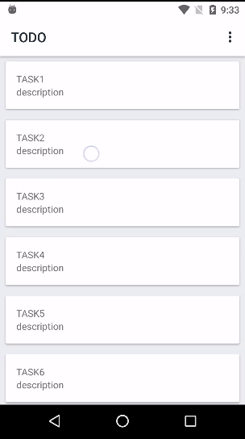

# Example of using ItemTouchHelper
* Kotlin
* [ItemTouchHelper](https://developer.android.com/reference/android/support/v7/widget/helper/ItemTouchHelper.SimpleCallback.html)   

## Prerequisites
* Android SDK 25
* Android Build Tool 25.0.2
* Android Support Library 25.4.0
* Android Plugin for Gradle 3.0.0-alpha8
* Kotlin 1.1.3-2

## Getting Started
Build with Android Studio 3.0
